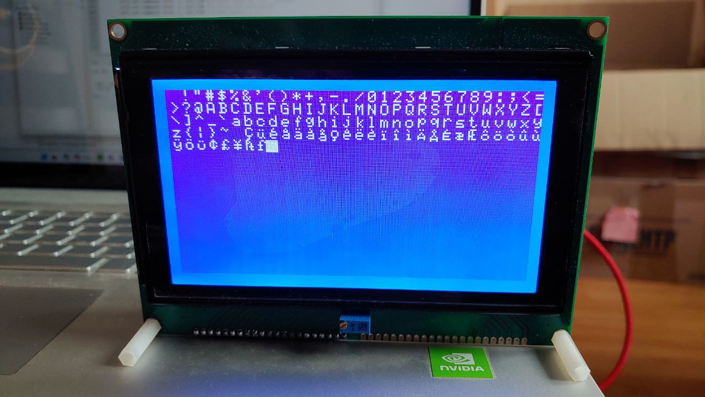

# micropython-lcd240128
Library for LCD 240128 display ( with FrameBuffer )



**Pinout**
|N  | Name | Comments |
|---|------|------------------------------------|
|1  |	FG  |	Frame Ground
|2  |	GND |	Ground
|3  |	Vcc	|	+5V
|4  |	Vo	|	Operating voltage for LCD
|5  |	WR	|	Data Write L-> H: Write
|6  |	RD	|	Data Read, L: Enabled
|7  |	CE	| Chip Enabled, L: Enabled
|8  |	CD	| Command / Data, L: Data, H: Command
|9  | RST | Reset, L: Active
|10 |	DB0	|	}
|...|	DB..|	} Data bus 8-bit
|17 |	DB7	|	}
|18 |	FS	|	Font Size, L: 8x8, H: 6x8
|19 |	Vout|	-10v Out voltage for LCD driving
|20 |	 A  |	+5v backlight Anode
|21 |	 K  |	GND backlight Kathode

3 and 19 pins are used to adjust the display contrast through a resistor.
I use a 1 Mega Ohm variable resistor. Acceptable contrast ~270kOm.

**Code example:**

```python
# Works on Raspbery Pi Pico. For other controllers - check available pins!

from lcd240128 import LCD240128

# Set pins here
lcd = LCD240128( wr = 14, rd = 13, ce = 12, cd = 11, rst = 10, fs = 1,
                db0 = 9, db1 = 8, db2 = 7, db3 = 6, db4 = 5, db5 = 4, db6 = 3, db7 = 2,
                rotation = 0 )

lcd.fill( 0 )
lcd.text( "Micropython!", 0, 0 )
lcd.show()
```
## File Structure:
* **lcd240128.py** - Main library LCD240128 ( Suitable for Esp32-family, RP2 )
* **lcd240128_rp2.py** - Main library LCD240128 ( Raspberry Pi Pico only ). Much faster than lcd240128.py
* **examples/** - a set of examples for using the library lcd240128
* **examples_rp2/** - a set of examples for using the library lcd240128_rp2
* **for_examples/** - files related to the examples
* **tools/font_to_py.py** - Used to convert ttf font to py-script. First of all, you need to install: `pip install freetype-py`. Then run a command similar to the example: `python font_to_py.py -x LibreBodoni-Bold.ttf 24 LibreBodoni24.py`. More details: https://github.com/peterhinch/micropython-font-to-py

## Display functions:
* **clear( self ):** - Clear display.
* **set_inversion( self, on = 1 ):** - Set display inversion
* **set_font( self, font ):** - Set font for text
* **set_text_wrap( self, on = True ):** - Set text wrapping
* **draw_text( self, text, x, y, color = 1 ):** - Draw text on display
* **draw_bitmap( self, bitmap, x, y, color ):** - Draw a bitmap on display
* **load_bmp( self, filename, x = 0, y = 0, color = 1 ):** - Load monochromatic BMP image on FrameBuffer
* **show( self ):** - Send FrameBuffer to lcd
* **other FrameBuffer functions** - see more on https://docs.micropython.org/en/latest/library/framebuf.html#module-framebuf

## Text mode functions (Embedded display symbols):
* **init_text_mode( self ):** - Text mode initialization. Default is graphic mode.
* **clear_space( self ):** - Clear display. Fill display by Space symbols.
